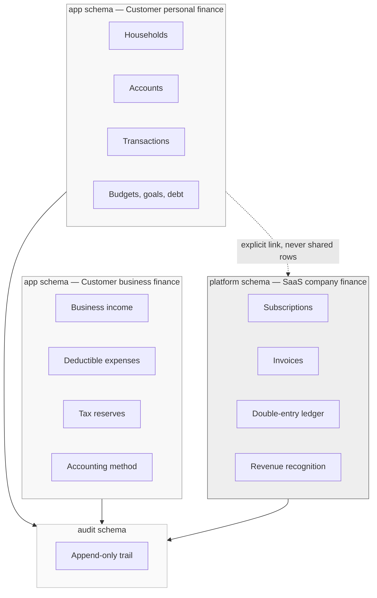
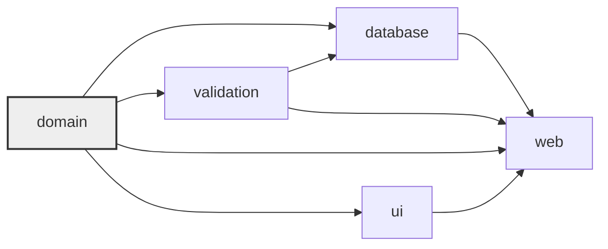

# Architecture

## What this system is

A financial operating system for households, couples, families and independent
professionals. It ingests financial information, normalizes it, refuses to
duplicate it, categorizes it, learns from corrections, and produces concrete
recommendations about what money should do next.

The recommendation engine is deterministic. AI explains its output; it is never
the source of truth for a balance, a tax figure, a permission or a ledger entry.

## The three financial worlds

The single most expensive mistake available in this codebase is mixing these.
They are separated at the schema level from the first migration.



A customer's subscription payment is two things at once: a transaction in their
household, and a revenue event for the company. It is recorded twice, in two
domains, with an explicit link — never as one shared row.

## Repository layout

```
apps/
  web/                Next.js 16 application (marketing + product + API routes)

packages/
  config/             tsconfig bases, ESLint flat configs, shared tooling
  domain/             Money, PlainDate, branded IDs, Result — pure, no deps
  validation/         Zod primitives and validated environment access
  database/           Drizzle schema, clients, migrations, seed
  ui/                 Design system (tokens today, components from Phase 1)

supabase/
  migrations/         Versioned SQL. The source of truth for schema shape.

docs/                 This directory
```

Engine packages are created in the phase that first needs them, each with its
first test. Empty packages are deferred work wearing the costume of
architecture. Built so far:

| Package              | Phase | Holds                                                          |
| -------------------- | ----- | -------------------------------------------------------------- |
| `transaction-engine` | 4–5   | Parsers, normalization, fingerprints, duplicates, transfers    |
| `category-engine`    | 6     | Merchant normalization, classification, learning from rules    |
| `budget-engine`      | 7     | Budget state, recurrence detection, safe-to-spend, forecasting |
| `debt-engine`        | 8     | Daily interest, payoff simulation, avalanche/snowball ordering |
| `rule-engine`        | 9     | The `WHEN`/`THEN` language, validation, evaluation             |
| `allocation-engine`  | 10    | The priority ladder that decides where the next dollar goes    |
| `ai`                 | 11    | Provider abstraction, versioned prompts, guardrails, cost      |
| `scenario-engine`    | 11    | Deterministic "what if" projections over a position snapshot   |
| `tax-engine`         | 12    | Versioned sourced rules, brackets, reserve, expense classes    |
| `reporting`          | 13    | Statements, reconciliation, monthly close, health, exports     |
| `billing`            | 14    | Plan catalogue, entitlements, proration, idempotent webhooks   |
| `ledger`             | 15    | Chart of accounts, journal entries, trial balance, SaaS metrics |

## Dependency direction



`domain` depends on nothing. It holds the primitives that must be correct
regardless of framework, database or delivery mechanism, and it is the package
with the highest test density in the repository.

Nothing depends on `web`. The application is a delivery mechanism, not a place
where financial rules live.

## Request path

```mermaid
sequenceDiagram
    participant U as Browser
    participant P as proxy.ts
    participant R as Route / Server Component
    participant D as Drizzle (pooled)
    participant PG as Postgres + RLS

    U->>P: GET /
    P->>P: Resolve locale (cookie → Accept-Language → es)
    P-->>U: 307 → /es
    U->>R: GET /es
    R->>D: withUserContext(claims, work)
    D->>PG: BEGIN; set_config('request.jwt.claims', …, true)
    PG->>PG: RLS policies evaluate against claims
    PG-->>D: Rows this tenant may see
    D-->>R: Typed result
    R-->>U: Rendered HTML
```

Claims are set transaction-locally. When the transaction ends the settings are
discarded, so a pooled connection can never carry one user's identity into
another user's request. That property is why RLS-scoped reads and financial
writes go through `withUserContext` rather than a bare query.

## Database access

Two connections, and the difference between them is the primary security
boundary:

|                     | `getDb()`         | `getAdminDb()`                  |
| ------------------- | ----------------- | ------------------------------- |
| Role                | `authenticated`   | owner                           |
| RLS                 | Enforced          | Bypassed                        |
| Port                | 6543 (pooler)     | 5432 (direct)                   |
| Prepared statements | Disabled          | Enabled                         |
| Used by             | Request handlers  | Migrations, jobs, seeds         |
| Tenant scoping      | Postgres policies | The caller's own responsibility |

Both live behind a module-level guard that throws if `@app/database` is ever
imported into a browser bundle, and `apps/web/src/server/database.ts` adds
`server-only` on top so the mistake becomes a build error.

## Environment

Configuration is read in exactly one module, validated with Zod, and memoized. A
lint rule makes `process.env` an error everywhere else. A missing variable fails
with every problem listed at once rather than surfacing later as `undefined` in
a connection string.

## What Phase 0 deliberately does not contain

Auth, tenancy tables, RLS policies for user data, any financial engine, AI,
billing, CMS, the marketing site, and the product's actual visual identity.
Each has a phase. See [roadmap.md](roadmap.md).
