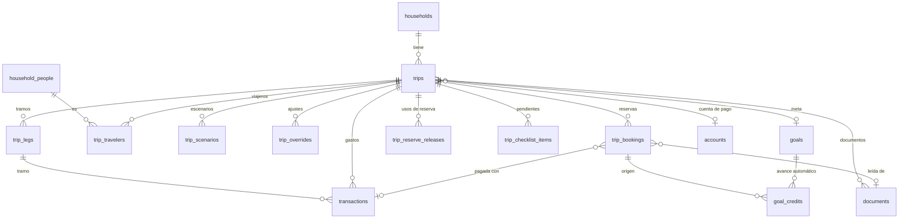

# Viajes — Fase 1: diseño técnico

Modelo final con nombres reales, contratos del servidor, flujos y decisiones.
Parte de [00-reconocimiento.md](00-reconocimiento.md) y de las respuestas del
dueño del producto del 2026-10-01 (registradas en §7).

---

## 1. Principios que este diseño no negocia

1. **Un gasto de viaje es un `app.transactions`.** No existe tabla de gastos.
   Las columnas nuevas son todas nulas: una fila sin `trip_id` es exactamente lo
   que era antes.
2. **El dinero es `numeric(19,4)` y `Money` a escala 4** (ADR-005). Los sufijos
   `_minor` de la especificación desaparecen.
3. **Las fechas del viaje son `date`** (ADR-006). El día de viaje de un gasto se
   calcula con la zona horaria del tramo y se guarda como `trip_day date`.
4. **El motor es puro** (`packages/trip-engine`): sin I/O, sin `new Date()`, con
   `today` inyectado y `ENGINE_VERSION` en cada salida.
5. **La IA extrae; el código calcula.** El modelo nunca ve un presupuesto.
6. **Todo detrás de `trips_module`.** Con el flag apagado, ninguna ruta, acción
   ni elemento de navegación existe para el hogar.

## 2. Modelo de datos

### 2.1 Tipos nuevos

```sql
create type app.trip_status        as enum ('idea','planning','saving','booked','in_progress','completed','cancelled');
create type app.trip_profile       as enum ('economy','balanced','comfort','custom');
create type app.trip_contingency   as enum ('percent','fixed');
create type app.trip_rolling       as enum ('rolling','fixed');
create type app.trip_cost_level    as enum ('low','medium','high','very_high');
create type app.trip_lodging_mode  as enum ('undecided','prepaid','pay_on_site','none');
create type app.trip_traveler_type as enum ('adult','child','infant');
create type app.trip_booking_type  as enum ('flight','lodging','insurance','tour','transport','visa','other');
create type app.trip_payment_status as enum ('paid','deposit_paid','pay_later','pay_on_site');
```

`lodging_mode` gana `undecided` frente a la especificación: «todavía no sé
dónde duermo» es el caso que hace que el motor reserve hospedaje del fondo, y
necesita un valor propio en vez de un nulo.

### 2.2 Tablas nuevas (esquema `app`, RLS forzada)

Todas llevan `id uuid default public.uuid_generate_v7()`, `household_id`,
`created_at`, `updated_at` con el trigger `set_updated_at`, y la política
`<tabla>_household_access for all using/with check
(app.is_household_member(household_id))` más lectura para contador
(`has_accountant_access`). Cada tabla hija repite `household_id` y una FK
compuesta `(trip_id, household_id) → trips (id, household_id)` para que una
fila no pueda colgar de un viaje de otro hogar aunque la política se equivoque.

| Tabla                   | Columnas clave                                                                                                                                                                                                                                                                                                                                                                                                                                                                                                                                                                                 |
| ----------------------- | ---------------------------------------------------------------------------------------------------------------------------------------------------------------------------------------------------------------------------------------------------------------------------------------------------------------------------------------------------------------------------------------------------------------------------------------------------------------------------------------------------------------------------------------------------------------------------------------------- |
| `trips`                 | `name`, `status`, `start_date`, `end_date`, `base_currency`, `total_budget`, `already_saved`, `contingency_type`, `contingency_value`, `profile`, `custom_shares jsonb`, `include_arrival_day`, `include_departure_day`, `partial_day_weight numeric(4,3) default 0.5`, `rolling_policy`, `goal_id → goals`, `funding_account_id → accounts`, `active_scenario_id`, `reserve_released numeric(19,4) default 0`, `planning_fx jsonb`, `cover_emoji`, `notes`, `created_by`, `completed_at`, `archived_at`. Check `end_date >= start_date`, montos `>= 0`, `partial_day_weight between 0 and 1`. |
| `trip_legs`             | `trip_id`, `position`, `city`, `country_code char(2)`, `place_label`, `arrival_date`, `departure_date`, `local_currency char(3)`, `cost_level`, `cost_index numeric(4,2)`, `timezone`, `lodging_mode`. Check de fechas; un trigger rechaza tramos fuera del rango del viaje o solapados más de un día de transición.                                                                                                                                                                                                                                                                           |
| `trip_travelers`        | `trip_id`, `person_id → household_people` (nulo para quien no es de la casa), `display_name`, `traveler_type`, `weight numeric(4,3)`.                                                                                                                                                                                                                                                                                                                                                                                                                                                          |
| `trip_scenarios`        | `trip_id`, `name`, `params jsonb` (fondo, reserva, perfil, porcentajes, supuestos de tasa), `position`.                                                                                                                                                                                                                                                                                                                                                                                                                                                                                        |
| `trip_overrides`        | `trip_id`, `scenario_id` nulo, `leg_id` nulo, `trip_day` nulo, `category`, `amount`. Ajustes manuales; el motor reparte el resto alrededor. Único por (trip, scenario, leg, day, category).                                                                                                                                                                                                                                                                                                                                                                                                    |
| `trip_bookings`         | `trip_id`, `leg_id`, `booking_type`, `provider`, `reference_code`, `starts_at`, `ends_at` (`timestamptz`: son horarios de itinerario, no fechas financieras), `amount`, `currency`, `amount_base`, `fx_rate numeric(20,10)`, `fx_rate_date`, `payment_status`, `paid_amount`, `due_date`, `transaction_id → transactions`, `document_id → documents`, `details jsonb`, `deleted_at`.                                                                                                                                                                                                           |
| `trip_reserve_releases` | `trip_id`, `trip_day`, `amount`, `note`, `created_by`. Cada uso de la reserva queda como fila; `trips.reserve_released` es su suma, mantenida en la misma transacción.                                                                                                                                                                                                                                                                                                                                                                                                                         |
| `trip_checklist_items`  | `trip_id`, `booking_id` nulo, `kind`, `title_key`, `title_params jsonb`, `due_on`, `done_at`, `done_by`. El texto sale del catálogo i18n, no de la fila.                                                                                                                                                                                                                                                                                                                                                                                                                                       |
| `goal_credits`          | `goal_id`, `source_kind` (`trip_booking`), `source_id`, `amount`. El avance automático de una meta, reversible y con origen (§7, decisión 4).                                                                                                                                                                                                                                                                                                                                                                                                                                                  |

**No se crea `trip_allocations`.** Ver §6, decisión A.

### 2.3 Tablas extendidas (solo columnas nulas o valores de enum)

**`app.transactions`**

| Columna               | Tipo                                           | Para qué                                                                                        |
| --------------------- | ---------------------------------------------- | ----------------------------------------------------------------------------------------------- |
| `trip_id`             | `uuid → trips on delete set null`              | Pertenece a un viaje                                                                            |
| `trip_leg_id`         | `uuid → trip_legs on delete set null`          | Tramo                                                                                           |
| `trip_category`       | `text` check en las claves del motor           | Categoría de viaje                                                                              |
| `trip_day`            | `date`                                         | Día local del viaje                                                                             |
| `paid_by_traveler_id` | `uuid → trip_travelers on delete set null`     | Quién pagó                                                                                      |
| `original_amount`     | `numeric(19,4)`                                | Monto en moneda local, con signo igual a `amount`                                               |
| `original_currency`   | `char(3) → platform.currencies`                | Moneda local                                                                                    |
| `fx_rate`             | `numeric(20,10)`                               | Base por unidad local usada                                                                     |
| `fx_rate_date`        | `date`                                         | Día de la tasa                                                                                  |
| `fx_source`           | `text` check (`ecb`,`manual`,`card_statement`) | Origen                                                                                          |
| `client_ref`          | `uuid`                                         | Idempotencia de gastos creados sin conexión o con doble toque; único por hogar donde no es nulo |

Check: las cinco columnas de moneda original van todas o ninguna. Índice
parcial `(trip_id, trip_day) where trip_id is not null and deleted_at is null`.

**`app.documents`**: `trip_id` nulo; valores nuevos de `app.document_kind`:
`flight_itinerary`, `boarding_pass`, `lodging_confirmation`, `ticket`,
`insurance_policy`.

**`app.ai_feature`**: `trip_document_extract`, `trip_quick_create`.

**`platform.currencies`**: filas de las monedas de destino más comunes desde
Panamá (EUR, GBP, COP, MXN, CRC, GTQ, DOP, PEN, CLP, ARS, BRL, CAD, JPY, CHF…)
con sus decimales. `CURRENCY_CODES` del dominio **no cambia**: las cuentas y
`transactions.currency` siguen en USD/PAB (decisión 1). La moneda local vive en
`original_currency`, `trip_legs.local_currency` y `trip_bookings.currency`, y el
motor la maneja como un par (código, decimales) sin pasar por `Money`.

### 2.4 Tablas de plataforma

**`platform.fx_rates`**: `base char(3)`, `quote char(3)`, `rate numeric(20,10)`
(unidades de `quote` por una de `base`), `rate_date date`, `source`, único por
(base, quote, date, source). Lectura para `authenticated`; escritura solo del
cron con `getAdminDb`.

**`platform.feature_flags`**: fila `trips_module`, `default_enabled = false`,
más un override `scope = 'household'` para el hogar del dueño (decisión 8).

### 2.5 Categorías

`seed-data.ts` gana diez plantillas hijas de `travel`: `travel-lodging`,
`travel-food`, `travel-local-transport`, `travel-activities`,
`travel-shopping`, `travel-other`, `travel-flights`, `travel-insurance`,
`travel-visas`, `travel-long-transport`. La migración ejecuta
`app.seed_household_categories` para cada hogar existente, que es idempotente.
La clave de viaje se resuelve a `category_id` por `template_slug` al escribir el
movimiento; si el hogar borró o archivó la subcategoría, cae en `travel`.

### 2.6 Diagrama



## 3. El motor (`packages/trip-engine`)

```ts
export const ENGINE_VERSION = '1.0.0';

computeTripBudget(input: TripBudgetInput): TripBudget
```

**Entrada**: `baseCurrency`, `totalBudget: Money`, `today: PlainDate`,
`startDate`, `endDate`, `legs[]` (fechas, `costIndex`, `lodgingMode`,
`localCurrency`, `fxToBase`), `travelers[]` (pesos), `bookings[]` (tipo,
estado, monto y pagado en base), `contingency`, `profile` o `customShares`,
`partialDays` (`includeArrival`, `includeDeparture`, `weight`), `overrides[]`,
`spent[]` (por día y categoría, en base), `reserveReleased`, `rollingPolicy`.

**Salida**: `days[]` (fecha, tramo, tipo completo/llegada/salida, peso,
asignación por categoría, gastado, restante), `byLeg[]`, `byCategory[]`,
`commitments` (prepagado, por pagar, por tipo), `reserve` (planificada,
liberada, disponible), `fundForDays`, `perDiem` (base y local por tramo,
completo y parcial), `perTraveler[]`, `today` (permitido, gastado, restante,
por categoría) cuando `today` cae en el viaje, `diagnostics` (estado, faltante,
advertencias, sugerencias, todas con números), `engineVersion`, y una
**prueba de suma**: `prepaid + pending + reserve + Σ asignaciones diarias =
totalBudget` exacto, verificada antes de devolver.

**Pasos** (los de la especificación §6, con los detalles de Cifra):

1. Días: `PlainDate` desde `startDate` hasta `endDate`; peso 1 o el parcial.
   El día de transición pertenece al tramo que llega.
2. Compromisos: pagado + pagado parcial; pendiente = saldo de `pay_later`,
   `pay_on_site` y `deposit_paid`.
3. Reserva: porcentaje con `Money.percentage(…, 'down')` o fijo, nunca negativa.
4. Fondo para días; si es negativo, estado `deficit` y sugerencias.
5. Hospedaje: por noche en tramos `undecided`; cero en los demás.
6. Reparto entre días con peso `pesoDía × costIndex` vía `Money.allocate`
   (mayor residuo).
7. Reparto por categoría con el perfil, renormalizado sin hospedaje cuando está
   cubierto. Los porcentajes viven como enteros en puntos básicos para que la
   renormalización no use flotantes.
8. Por viajero: `allocate` con los pesos de los viajeros.
9. Redondeo: todo `allocate` trabaja en unidades de la moneda (centavos); la
   escala 4 de `Money` se redondea al centavo antes de repartir para que ningún
   per diem muestre fracciones de centavo.
10. Diagnóstico: reglas deterministas (menos días, otra reserva, otro perfil,
    meses extra con la capacidad que pase el servidor).
11. Modo rodante: lo gastado en días pasados se descuenta y lo que queda se
    reparte entre hoy y los días que faltan con los mismos pesos; `fixed`
    acumula el desvío aparte. Nunca un per diem negativo.

`budgetSuggestion(destination, days, travelers, costLevel)` da el rango
estimado del asistente con una tabla de referencia por nivel de costo,
marcada como estimado. `CostIndexProvider` es la interfaz para conectar una
fuente real en el futuro.

## 4. Servidor

Acciones `'use server'` en `apps/web/src/server/trip-actions.ts`,
`trip-booking-actions.ts`, `trip-expense-actions.ts`,
`trip-document-actions.ts`; lecturas en `server/repositories/trips.ts`. Cada
acción: `requireTripsModule()` (flag) → zod → `loadSession` → `queryAsUser` →
`revalidatePath`, devolviendo `RecordActionResult`.

| Acción                                                                                  | Efecto                                                                                 |
| --------------------------------------------------------------------------------------- | -------------------------------------------------------------------------------------- |
| `createTrip`, `updateTrip`, `archiveTrip`, `duplicateTripAsTemplate`                    | Viaje y estado                                                                         |
| `saveTripLeg`, `deleteTripLeg`, `reorderTripLegs`                                       | Tramos                                                                                 |
| `saveTripTraveler`, `deleteTripTraveler`                                                | Viajeros                                                                               |
| `saveTripBooking`, `deleteTripBooking`, `markBookingPaid`                               | Reserva; al pagarla crea o enlaza el movimiento y acredita la meta, en una transacción |
| `recordTripExpense`, `updateTripExpense`, `deleteTripExpense`                           | Movimiento con columnas de viaje; `client_ref` hace la creación idempotente            |
| `recordCashWithdrawal`                                                                  | Transferencia entre cuentas con tasa real                                              |
| `saveScenario`, `activateScenario`, `deleteScenario`                                    | Escenarios                                                                             |
| `saveOverride`, `clearOverride`                                                         | Ajustes manuales                                                                       |
| `releaseReserve`                                                                        | Mueve reserva al fondo de días                                                         |
| `linkTripGoal`, `createTripGoal`                                                        | Meta del viaje                                                                         |
| `closeTrip`                                                                             | Cierre, sobrante a una meta o cuenta                                                   |
| `uploadTripDocument`, `confirmTripDocument`, `discardTripDocument`, `retryTripDocument` | OCR                                                                                    |
| `toggleChecklistItem`                                                                   | Pendientes                                                                             |

Lectura principal: `loadTripDashboard(tripId)` hace cuatro consultas (viaje +
tramos + viajeros; reservas; gastos agregados por día y categoría; meta y
capacidad) y corre el motor.

## 5. Flujos

**Desde el dinero**: asistente → `createTrip` con tramos y viajeros en una
transacción → motor al vuelo → «Tu plan» → `createTripGoal` opcional.

**Desde documentos**: subida → `stageDocument` (mismo hash, mismo R2) → job
`trip_document` → clasificación → extracción por tipo con el proveedor de
`packages/ai` (registrado en `ai_invocations`) → normalización determinista →
pantalla de revisión → `confirmTripDocument`, que en **una transacción** crea
o ajusta el viaje, el tramo, la reserva y, si está pagada, el movimiento y el
crédito de la meta.

**En viaje**: «Hoy puedes gastar» = `today.remaining` del motor. Gasto en tres
toques → `recordTripExpense` con `client_ref`. Sin conexión: la cola en
IndexedDB guarda el gasto con su `client_ref` y lo reenvía; el servidor ignora
un `client_ref` repetido y devuelve el movimiento existente.

**Cierre**: reporte del motor con `spent` completo → `closeTrip` → sobrante a
meta o cuenta con un movimiento real.

## 6. Decisiones de diseño

**A. Asignaciones calculadas al vuelo, no persistidas.** El motor es puro y su
objetivo es < 50 ms para 60 días, 5 tramos y 500 gastos. Persistir obligaría a
invalidar en cada gasto, reserva, tasa o ajuste: diez caminos para un caché que
no hace falta. Se persisten solo los insumos que son decisiones humanas
(ajustes, escenarios, usos de reserva). `engineVersion` va en cada respuesta y
en el reporte de cierre, que sí guarda su resultado en `trips.closing_report
jsonb` porque el pasado no debe cambiar si el motor cambia.

**B. Extender `transactions` en vez de `trip_expenses`.** Es lo que pide la
especificación y lo que el modelo permite: columnas nulas, sin tocar las
existentes.

**C. Moneda local fuera de `Money`.** Ver decisión 1 del dueño. El motor
representa montos locales como unidades enteras con su código; la conversión
a base es una multiplicación con `numeric` y redondeo explícito.

**D. Categorías de viaje en código, no en tabla.** Las diez claves son del
motor; el mapeo contable es la plantilla `travel-*`. Las categorías
personalizadas de viaje quedan fuera de la v1.

**E. Los presupuestos mensuales excluyen gastos con `trip_id`** cuando el viaje
tiene meta vinculada (`trips.goal_id is not null`), tal como pide la
especificación. Los reportes ganan un filtro con o sin viajes.

## 7. Decisiones del dueño del producto (2026-10-01)

| #   | Pregunta            | Respuesta                                                            |
| --- | ------------------- | -------------------------------------------------------------------- |
| 1   | Monedas extranjeras | Moneda local como dato original del gasto; cuentas siguen en USD/PAB |
| 2   | Tasas               | BCE diaria (Frankfurter, sin clave) con corrección manual            |
| 3   | Categorías          | Subcategorías dentro de «Viajes»                                     |
| 4   | Avance de la meta   | Automático con origen (`goal_credits`)                               |
| 5   | Proveedor de IA     | Hay clave en producción (OpenAI)                                     |
| 6   | Fallos del OCR      | Se arreglan en la fase de documentos                                 |
| 7   | Permisos            | Igual que el resto: cualquier miembro edita                          |
| 8   | Flag                | Encendido solo para el hogar del dueño                               |
| 9   | Ritmo               | Todas las fases seguidas                                             |
| 10  | Despliegue          | Push a producción al cerrar cada fase en verde                       |
| 11  | Sin conexión        | En la fase «En viaje»                                                |
| 12  | Base de datos       | Contraseña en `.claude/settings.local.json`                          |
